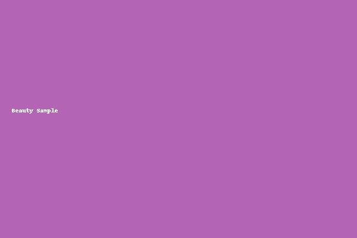
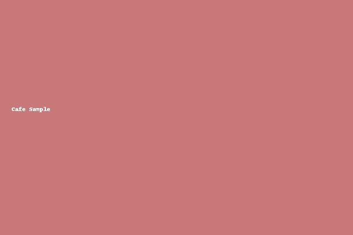
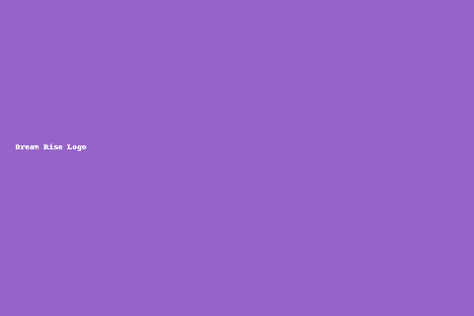

# dream-rise<!DOCTYPE html>
<html lang="ja">
<head>
  <meta charset="UTF-8">
  <title>Dream Rise</title>
  <link rel="stylesheet" href="style.css">
</head>
<body>
  <h1>Dream Rise サンプルページ</h1>
  
  <h2>Beauty</h2>
  

  <h2>Cafe</h2>
  

  <h2>Logo</h2>
  
</body>
</html>
